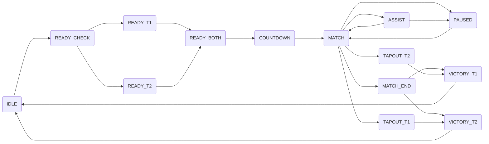

# The Battle Box Controller

Featuring:

- Arcadian, the brains
- Larry, the judgiest
- Fred
- Amadeus

PS...I'm sorry that Larry is such a mess. There was some debugging that led to a whole lot of slop :(

## Architecture

There are two components to the Battle Box Controller, Larry and Arcadian. These are both projects for the ESP32. They communicate using the [ESP-NOW wireless communication protocol](https://www.espressif.com/en/solutions/low-power-solutions/esp-now) (basically a lightweight WiFi messaging protocol). There is a pinout diagram in the docs folder (it's hand drawn).

### Physical Components

#### Arcadian

Arcadian is the "brain" of the system. It controls the LEDs, maintains the state of the match, and gets input from the two button panels for each team (ready, assist, tapout buttons on Fred and Amadeus).

#### Larry

Larry is the button panel, it does control the match time, but otherwise takes orders from Arcadian when it comes to the match state. Larry has a bunch of buttons (to be documented) and LEDs that are illuminated beneath those buttons when they can be used (i.e. unlit buttons have no function).

### Software Components

There's a lot here, but here's a summary of the states. The "game" is a state machine. I'll add a flow diagram at some point, but for now, here are the states:

#### Match States

| **State**     | **Description**                                               |
|---            |---                                                            |
| `NO_STATE`    | Empty state for code, but game never in this state            |
| `IDLE`        | The default state, waiting on judges to start match           |
| `READY_CHECK` | Game has been started, waiting for teams to ready up          |
| `READY_T1`    | Team 1 is ready, waiting on team 1 to ready up                |
| `READY_T2`    | Team 2 is ready, waiting on team 1 to ready up                |
| `READY_BOTH`  | Both teams are ready, waiting on judges to start match        |
| `COUNTDOWN`   | Countdown to match start, will transition into match          |
| `MATCH`       | Match is in progress                                          |
| `ASSIST`      | A team has requested an assist, judges may disable            |
| `PAUSED`      | Match is paused, may be unpaused by judge                     |
| `MATCH_END`   | Match has ended, will transition to victory on judge input    |
| `TAPOUT_T1`   | Team 1 has tapped out, will transition to team 2 victory      |
| `TAPOUT_T2`   | Team 2 has tapped out, will transition to team 1 victory      |
| `VICTORY_T1`  | Team 1 has won, transition to idle on reset                   |
| `VICTORY_T2`  | Team 2 has won, transition to idel on reset                   |

##### State Flowchart

**Note:** Reset to `IDLE` state is possible from any state other than `COUNTDOWN`, `MATCH`, `ASSIST`, and `PAUSED`
